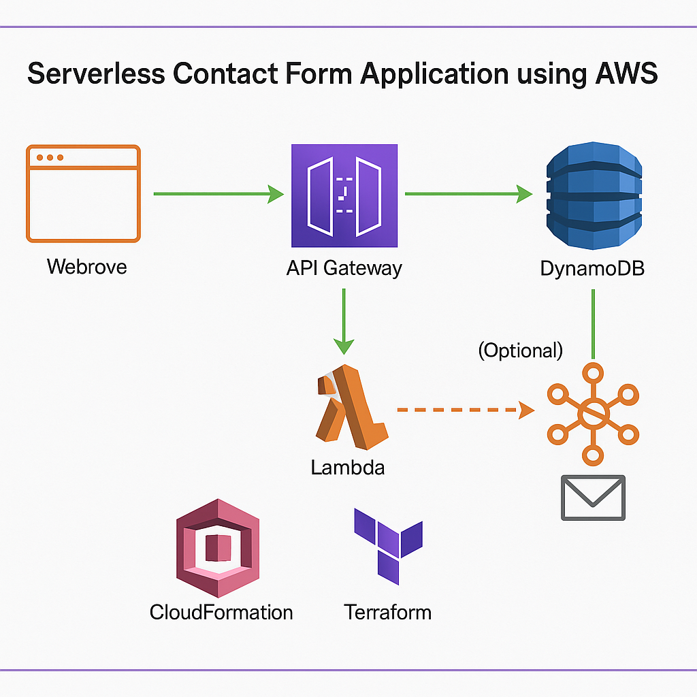

# 📬 Serverless Contact Form App (GreenNest Farms)

This is a simple, fully serverless contact form application built for **GreenNest Farms**. It allows users to submit messages via a static web form. Messages are stored in **DynamoDB**, processed by **AWS Lambda**, and optionally notify the business owner via **email** using **SNS**.

---

## 🌐 Live Demo (Optional)
📄 Frontend hosted on S3:  
`https://greennest-contact-frontend.s3-website-us-east-1.amazonaws.com`

---

## 📦 Tech Stack

| Layer      | Service       | Description                         |
|------------|----------------|-------------------------------------|
| Frontend   | HTML/CSS/JS    | Simple static form                  |
| API        | API Gateway    | Exposes a POST endpoint             |
| Backend    | AWS Lambda     | Processes and validates submissions |
| Storage    | DynamoDB       | Stores contact messages             |
| Alerts     | SNS (Optional) | Sends email on new message          |
| IaC        | CloudFormation | Full deployment script              |

---

## 🚀 Features

✅ Accepts `name`, `email`, and `message`  
✅ Validates input server-side  
✅ Saves to DynamoDB  
✅ Sends email via SNS (optional)  
✅ Frontend hosted on S3  
✅ Infrastructure as Code with CloudFormation  
✅ GitHub Actions CI/CD (optional)

---

## 🏗 Architecture Diagram



---

## 📁 Folder Structure

serverless-contact-form/
├── frontend/
│ └── index.html
├── lambda/
│ └── submitMessage.js
├── diagrams/
│ └── contact-app.drawio
│ └── contact-app.png
├── templates/
│ └── cloudformation.yaml
├── .github/
│ └── workflows/
│ └── deploy.yml
└── README.md

---

## ⚙️ Deployment Instructions

### 1. ✅ Deploy Infrastructure (CloudFormation)
- Upload your Lambda zip to S3
- Deploy the template via Console or CLI:

```bash
aws cloudformation deploy \
  --template-file templates/cloudformation.yaml \
  --stack-name contact-form-app \
  --parameter-overrides \
      LambdaFunctionName=ContactFormHandler \
      DynamoDBTableName=ContactMessages \
      EmailAddress=you@example.com \
  --capabilities CAPABILITY_NAMED_IAM

### 2.🔧 Setup Frontend (S3 Hosting)
